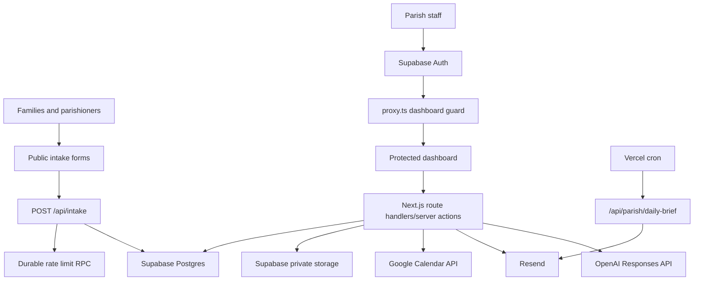
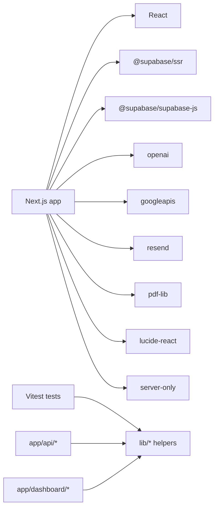
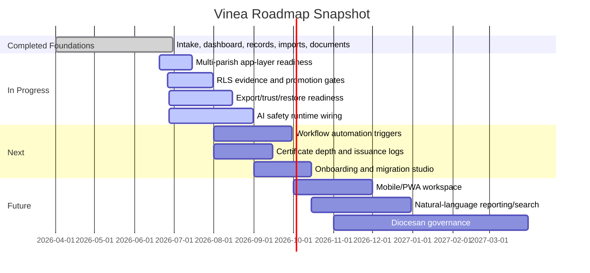

# Vinea Engineering and Product State Report

Generated: 2026-07-02
Repository: `priest-ops-assistant`
Purpose: complete handoff for independent architecture, product, security, and strategy review.

## 1. Executive Summary

Vinea Platform is a Catholic parish operations SaaS product. It turns family-facing parish requests into owned staff workflows with follow-up, scheduling, communication history, documents, people and household context, sacramental records, certificates, Mass intentions, reporting, audit trails, calendar integration, and staff-reviewed AI assistance.

The target customer is a Catholic parish office, parish cluster, pastorate, or diocesan pilot group that coordinates baptisms, funerals, weddings, OCIA, registrations, records, documents, and pastoral follow-up through email, spreadsheets, paper notes, disconnected calendars, and memory.

The core mission is to help Catholic parishes care for families with clarity, continuity, and accountability from first request through final record.

The primary value proposition is not simply "another church database." Vinea is the operational layer that tells parish staff what needs attention today, who owns it, what is blocked, what documents or communications are missing, and how the work connects to families, people, records, and schedules.

Competitive positioning:

| Position | Vinea angle |
| --- | --- |
| Against Catholic incumbents | More modern workflow UX, next-action orientation, safe AI, and faster parish-office adoption. |
| Against generic ChMS products | Catholic-specific sacramental, OCIA, funeral, wedding, household, certificate, and pastoral-care workflows. |
| Against communications tools | A true operating system of record and action, not only email/SMS/forms. |
| Against AI-forward church tools | AI is constrained, staff-reviewed, permission-aware, and embedded in real parish workflows. |

Long-term vision: Vinea should become the Catholic parish operating system: the trusted layer where intake, staff work, documents, communications, records, calendars, reporting, AI assistance, and diocesan governance meet.

Current maturity: late prototype to early pilot-readiness, with substantial product surface and strong safety/process documentation. The platform is not yet production-complete for diocesan/multi-parish scale. Current project completion is documented around 75 percent, with the largest remaining gaps in production RLS approval, production exports, observability, backup/restore claims, retention policy, owner signoff, and multi-parish governance.

Biggest accomplishments:

- Public intake for baptism, funeral, wedding, OCIA, and join-parish requests.
- Protected staff dashboard with request command center, role work hub, reports, onboarding, settings, staff access, audit log, communications, calendar, search, notifications, imports, people, households, sacramental records, certificates, and Mass intentions.
- Request workflow depth: assignments, statuses, waiting-on reasons, next follow-up, communications, notes, checklists, workflow templates, request documents, family portal tokens, and calendar events.
- Catholic-specific records: sacramental register, append-only events, baptism certificate generation, Mass intentions, OCIA and funeral workflow expansion.
- Security hardening: Supabase Auth, staff authorization, RLS, removal of direct anonymous table writes, durable public-intake rate limiting, active parish context, export gates, audit events, document route authorization, and trust-center evidence packets.
- AI foundation: AI summary and email draft routes using `gpt-5-mini`, plus non-runtime safety registry, retrieval DTOs, source display DTOs, audit metadata DTOs, staff review/status DTOs, and runtime gate scaffolding.
- Multi-parish foundation: `parish_memberships`, active parish context helpers, public intake routing schema, selected-parish read/write path migration work, and operational RLS candidate/evidence gates.

## 2. Product Vision

Vinea exists because parish work is high-touch, time-sensitive, and relationship-heavy, but the tools available to many offices are either generic databases, giving platforms, communication systems, or legacy Catholic systems with weak daily workflow ergonomics.

Core parish problems Vinea solves:

- Families submit urgent or important requests, but email and voicemail do not create reliable ownership.
- Staff handoffs are invisible.
- First contact, follow-up, documents, and schedule confirmation are easy to miss.
- Sacramental records and certificates are disconnected from preparation work.
- People and household context lives separately from requests.
- Pastors, deacons, coordinators, and front-desk staff need different daily views.
- Parish offices need auditability and data trust before diocesan pilots.
- AI can help, but only if it does not bypass staff judgment or expose sensitive data.

Competitors Vinea may replace or complement:

- Replace spreadsheets, shared inboxes, paper notebooks, ad hoc Google Docs, and standalone request forms.
- Complement ParishSOFT, Pushpay/ParishStaq, Realm, Breeze, Planning Center, or Rock RMS where those products remain the giving/member database but do not solve Catholic office workflows.
- Eventually replace incumbent parish management systems for parishes that value Catholic-specific workflow depth, better UX, safer AI, and modern governance over broad but generic modules.

Differentiators:

- Catholic-first workflows, not generic CRM objects.
- Request-to-record continuity.
- Role-aware daily work hub.
- Staff-reviewed AI with explicit safety boundaries.
- Family/person/household intelligence and duplicate review.
- Diocesan-grade tenancy, audit, export, and trust-center ambitions.
- Opinionated workflow templates for sacraments and pastoral care.

What Vinea should become:

- Short term: the best parish-office workflow tool for requests, follow-up, records, and documents.
- Medium term: a workflow automation and parish data integrity platform with strong onboarding, import, search, reporting, and communications.
- Long term: a Catholic parish and diocesan operating system with multi-parish governance, secure AI retrieval, certificate/notation depth, integrations, mobile/PWA workspace, and public trust center.

## 3. Complete Feature Inventory

### Marketing Site

Purpose: explain Vinea and capture demo interest.
Current functionality: landing page at `/`, brand assets, demo request route, screenshots, product messaging.
Implementation: Next.js page/components, `lib/productBranding.ts`, Resend-backed `/api/demo-request`.
Limitations: pricing, production domain, formal trust center, and support/sales contacts are not finalized.
Future: publish pricing/packaging, trust center, pilot case studies, integrations page, security/AI posture.

### Public Intake

Purpose: give families simple request entry points.
Current functionality: baptism, funeral, wedding, OCIA, and join-parish forms submit to `POST /api/intake`. The route validates type, required fields, email format, durable rate limit, creates parishioner/request/detail/checklist/workflow rows, writes audit events, and supports disabled-by-default parish routing by token/domain/slug in safe QA.
Implementation: `app/*-request/page.tsx`, `app/api/intake/route.ts`, durable `rate_limit_buckets`, service-role writes, public-intake routing helpers, workflow template instantiation RPC.
Limitations: production public intake routing remains gated; no prayer request or volunteer intake; limited spam/bot protection beyond rate limiting.
Future: custom parish intake URLs, embeddable forms, CAPTCHA or abuse scoring, more request types, family portal account handoff.

### Requests

Purpose: central operational unit for parish work.
Current functionality: request list/detail, statuses, assignment, priest/deacon assignment, next follow-up, waiting-on reasons, first review, timeline, internal notes, communications, checklist, workflow steps, type-specific detail sections, quick actions, ready-to-complete review, Google Calendar actions, AI tools, documents, portal tokens, relationship suggestions, record suggestions.
Implementation: `requests`, `checklist_items`, `request_notes`, `request_communications`, detail tables, workflow tables, request document tables, dashboard components, server actions, route handlers.
Limitations: status model is simple; not all sub-actions are fully policy-enforced at the database membership-aware RLS layer; no full task assignment notification loop.
Future: richer statuses, automation triggers, SLA escalations, saved views, bulk actions, task ownership, @mentions, family self-service updates.

### People

Purpose: structured person directory linked to requests and records.
Current functionality: list, create/edit/detail, request and sacramental record links, duplicate review and merge.
Implementation: `people` table, indexes by parish/name/email/phone, `lib/people.ts`, people pages/actions, duplicate route/helpers.
Limitations: relationship modeling is still basic; no sacramental family-of-origin or guardianship modeling; merge history is limited.
Future: richer relationship graph, pre-save duplicate prevention, merge audit history, source confidence, family-of-origin fields.

### Households

Purpose: model families/households for parish operations.
Current functionality: household list/detail/create/edit, household members, primary contact constraint, duplicate review/merge.
Implementation: `households`, `household_members`, household pages/actions, duplicate helpers, one-primary-contact unique index.
Limitations: household roles and complex family structures are basic; no household lifecycle/history.
Future: blended family support, guardians, separate mailing/registration households, split household communications, merge history.

### Sacramental Records

Purpose: Catholic register of sacramental and pastoral records.
Current functionality: records for baptism, marriage, funeral, confirmation, first communion, OCIA, RCIC; list/detail/create/edit; optional request and person links; append-only record events.
Implementation: `sacramental_records`, `sacramental_record_events`, enum type, triggers, `lib/sacramentalRecords.ts`, records pages/actions.
Limitations: correction workflows, notation controls, certificate issuance logs, and document attachments to records are incomplete.
Future: notation management, correction approval flow, certificate log, record locking, attachments, diocesan audit support.

### Certificates

Purpose: generate official-looking certificates from sacramental records.
Current functionality: baptism certificate PDF route exists at `/api/records/[id]/certificate` and certificate suggestion UI exists.
Implementation: server PDF generation code, `pdf-lib` dependency, certificate suggestion helpers.
Limitations: mostly baptism-focused; no issuance log; no parish seal/letterhead management; no canonical notation policy.
Future: marriage/confirmation/first communion/funeral certificates, certificate templates, watermark/seal, issuance history, reprint policy.

### Mass Intentions

Purpose: track Mass intention requests without adding accounting scope.
Current functionality: list, create/edit/detail, requester, intention text, requested date, assigned Mass date, priest, stipend received boolean, fulfilled flag, notes.
Implementation: `mass_intentions` table and dashboard intention pages/actions.
Limitations: no stipend amount, payment processing, accounting export, recurring intentions, calendar capacity management.
Future: Mass capacity rules, stipend ledger integration, recurring intentions, printable schedule, priest assignment views.

### Dashboard and Role Work Hub

Purpose: answer "what needs attention today?" for parish staff.
Current functionality: dashboard command center, summary counts, role lenses for Administrator, Front desk, Pastor, OCIA Coordinator, Sacramental Coordinator, today's care brief, staff workload, ownership health, care cadence, family care plans, communication commitments, insights, trend metrics.
Implementation: `app/dashboard/*`, `lib/dashboard*`, `lib/dashboardRoleWorkHub.ts`, tested helper functions.
Limitations: role preference persistence and deeper role-specific pages are incomplete; no mobile/PWA task surface.
Future: saved role views, personalized queues, mobile task mode, push notifications, role-level permissions.

### Reports

Purpose: operational visibility for parish leadership.
Current functionality: request analytics, trends, staff workload, parish insights, selected-parish scoped reporting UI.
Implementation: `/dashboard/reports`, `lib/dashboard/buildRequestAnalytics.ts`, dashboard loader helpers.
Limitations: no natural-language reporting, saved dashboards, exports to PDF/CSV from reports, or diocesan rollups.
Future: saved views, diocesan dashboards, plain-English query, report builder, export controls.

### AI

Purpose: reduce staff drafting and review time while keeping staff in control.
Current functionality: request summaries and email/reply drafts using OpenAI Responses API model `gpt-5-mini`; summary route has runtime gate scaffolding for future safety-chain generation and source/staff review output; non-runtime registry and DTO safety contracts exist.
Implementation: `/api/ai/summary`, `/api/ai/reply`, `lib/openai.ts`, `lib/aiSafetyRegistry.ts`, DTO/test files, AI approval docs.
Limitations: registry is not fully runtime-enforced for all generation paths; reply route is less safety-chain-wired than summary route; no source UI shipped broadly; no natural-language search.
Future: permission-scoped retrieval, source display, audit metadata writes, staff disposition capture, AI search/reporting, document intelligence after explicit approval.

### Communications

Purpose: keep family communication inside the operational workflow.
Current functionality: communication history, email send route, reply drafts, communication commitments, daily brief email, request notification email, demo request email.
Implementation: Resend, `lib/email/*`, `/api/email/send`, `/api/request-notifications`, `/api/parish/daily-brief`, communications dashboard.
Limitations: no real email threading, SMS, inbound email capture, template library, or unsubscribe/contact preferences.
Future: templated outbound communication, inbound sync, SMS, conversation timeline, communication consent/preferences.

### Calendar

Purpose: coordinate confirmed sacramental and pastoral events with parish calendars.
Current functionality: parish-level Google OAuth integration, create/update/delete Google Calendar events, selected-parish integration scoping, conflict checks, calendar dashboard, settings status. Vercel cron sends daily brief.
Implementation: `parish_google_integrations`, `googleapis`, OAuth start/callback routes, calendar event routes, `lib/parishGoogleCalendarServer.ts`, `vercel.json`.
Limitations: Google-only; reconnect/live QA depends on safe credentials; no Microsoft 365 calendar; no availability scheduling UX.
Future: Microsoft 365, availability finder, room/resource calendars, conflict prevention, schedule proposals.

### Authentication and Permissions

Purpose: protect staff surfaces and parish data.
Current functionality: Supabase Auth, protected `/dashboard`, allowlist/staff-users authorization, active parish context, selected-parish write helpers, RLS on key tables, membership foundation, staff management UI/API.
Implementation: `proxy.ts`, `lib/server/requireStaff.ts`, `lib/staffAuthorization.ts`, `staff_users`, `parish_memberships`, RLS helpers/functions.
Limitations: no MFA/SSO controls in app; role model is admin/staff; membership-aware operational RLS still gated.
Future: MFA/SSO, granular role matrix, field-level permissions, permission preview, diocesan roles.

### Settings and Onboarding

Purpose: make a parish ready to operate Vinea.
Current functionality: parish settings, notification email, directories, Google Calendar settings, workflow templates, staff access, onboarding readiness, SLA rules, daily brief settings.
Implementation: `/dashboard/settings`, `/dashboard/onboarding`, `parishes` settings columns, settings APIs.
Limitations: setup wizard is still basic; owner signoff and production configuration docs are separate.
Future: guided setup by parish size, import wizard memory, readiness scoring, in-product trust checklist.

### Imports

Purpose: onboard data from spreadsheets.
Current functionality: import people, households, and sacramental records with preview/commit and import batch history.
Implementation: `/dashboard/imports`, `/api/imports`, `import_batches`, `lib/parishDataImport.ts`.
Limitations: no competitor-specific migration adapters; field mapping memory limited; no rollback UI.
Future: ParishSOFT/PDS/eCatholic import templates, mapping memory, dry-run diff, undo/rollback packets.

### Search and Notifications

Purpose: reduce module hunting and surface urgent work.
Current functionality: global dashboard search, notifications center, active parish scoped loaders, grouped search results.
Implementation: `/api/dashboard/search`, `/api/dashboard/notifications`, `lib/globalSearch/*`, `lib/notificationsCenter/*`.
Limitations: no natural-language query, no saved search, no push/browser notifications.
Future: permission-aware NL search, saved views, watchlists, push/email digests.

### Documents and Family Portal

Purpose: handle request documents safely without exposing private storage.
Current functionality: private `request-documents` storage bucket, staff upload/list/review/download routes, manifest export, expiring hashed family portal tokens for document access, family portal route.
Implementation: `request_documents`, `request_portal_tokens`, storage bucket, document routes, `lib/server/requestDocumentAccess.ts`, family portal pages.
Limitations: document restore evidence is synthetic/non-production only; no document OCR; no record-level attachments; signed URL and raw storage details are intentionally not exported.
Future: document checklist UX, OCR/extraction with approval, record attachments, retention controls, stronger restore evidence.

### Audit and Exports

Purpose: prove and review sensitive operations.
Current functionality: audit events, admin audit log, request activity history, export gates, basic request export route, document manifest export route, export audit reviewer API/dashboard prototype, production export no-go evidence.
Implementation: `audit_events`, `/api/audit-events`, `/api/exports/*`, `/api/export-audit-reviewer`, export gate helpers/docs.
Limitations: production exports remain no-go until final approval/smoke; audit retention policy not final.
Future: production export rollout, role-based export controls, reviewer dashboard GA, retention/deletion policy enforcement.

## 4. Technical Architecture

### Stack

- Frontend: Next.js 16.2.2 App Router, React 19.2.4, TypeScript, Tailwind CSS 4, Lucide React.
- Backend: Next.js route handlers, server actions, server-only helpers.
- Database: Supabase Postgres with SQL migrations in `supabase/migrations`.
- Auth: Supabase Auth with staff authorization layered on top.
- Hosting: Vercel implied by `vercel.json`.
- AI: OpenAI SDK, Responses API, model `gpt-5-mini`.
- Email: Resend.
- Calendar: Google Calendar API via `googleapis`.
- Storage: Supabase Storage private bucket `request-documents`.
- PDF: `pdf-lib` in app; report PDF generated externally with bundled Python/reportlab.
- Tests: Vitest.

### Runtime Architecture

### Dependency Graph

### APIs

Major API surfaces:

- Public intake: `POST /api/intake`.
- AI: `POST /api/ai/summary`, `POST /api/ai/reply`.
- Email/notifications: `/api/email/send`, `/api/request-notifications`, `/api/demo-request`, `/api/parish/daily-brief`.
- Google: OAuth start/callback and calendar create/update/delete.
- Dashboard: search, notifications, imports, settings, workflow templates, staff users, public intake routing.
- Requests: detail access, documents, document downloads/review, portal tokens.
- Exports: basic request export, document manifest export, export audit reviewer.
- Admin: audit events, audit log.
- Family: family request portal document route.
- Health: `/api/health`.

### Security Model

- Supabase Auth identifies staff users.
- `proxy.ts` protects `/dashboard/:path*`.
- Staff authorization uses allowlist, `staff_users`, and development fallback only when staff access is not configured.
- Sensitive route handlers call `requireStaffFromRequest` or equivalent helpers.
- Public intake no longer depends on direct anonymous table writes; it uses server-side validation and service role.
- RLS exists on parish data tables; older policies use `primary_parish_id()` while the multi-parish migration path moves toward `is_authorized_for_parish()`.
- `parish_memberships` and active parish cookies provide future multi-parish scope.
- Google refresh tokens are stored in a service-role-only table.
- Request portal tokens are hashed, expiring, and revocable.
- Export routes are disabled behind runtime gates in production.
- AI generation is staff-gated; future safety chain is fail-closed when gates are enabled.

### State Management

State is mostly server-rendered or route-driven. There is no global client store. Client state lives in dashboard components for filters, tabs, forms, and role lenses. Persistent state uses URL/search params, cookies for active parish selection, and database rows.

### Background Jobs and Queue System

There is no general queue worker. Background behavior is limited to Vercel cron for `/api/parish/daily-brief` and synchronous route/server-action work. Future automation, email delivery retries, document processing, and AI workflows need a queue or scheduled job framework.

### Caching

No explicit application cache layer was found beyond framework/runtime behavior and database indexes. Search/report performance currently depends on Supabase queries and indexes.

### File Handling

Request documents use Supabase Storage private bucket `request-documents`; metadata lives in `request_documents`. Staff access is mediated through server routes. Family access uses hashed request portal tokens. Export surfaces intentionally avoid signed URLs, storage paths, original filenames, file contents, token material, internal notes, communications, AI material, and sacramental/canonical details unless separately approved.

### Environment Variables

Core:

- `NEXT_PUBLIC_SUPABASE_URL` or `SUPABASE_URL`
- `NEXT_PUBLIC_SUPABASE_ANON_KEY`
- `SUPABASE_SERVICE_ROLE_KEY`
- `NEXT_PUBLIC_APP_URL`

AI:

- `OPENAI_API_KEY`
- AI summary safety gate/ack variables documented in the AI approval files

Email:

- `RESEND_API_KEY`
- `RESEND_FROM_EMAIL`
- `DEMO_REQUEST_TO_EMAIL`
- `REQUEST_NOTIFICATION_TO_EMAIL`
- `VINEA_EMAIL_LOGO_URL`

Google:

- `GOOGLE_CLIENT_ID`
- `GOOGLE_CLIENT_SECRET`
- `GOOGLE_OAUTH_STATE_SECRET`

Auth/staff:

- `STAFF_ALLOWLIST_EMAILS`

Cron:

- `CRON_SECRET`

Feature/safety gates:

- `VINEA_EXPORT_RUNTIME`
- `VINEA_EXPORT_RUNTIME_ACK`
- `VINEA_EXPORT_RUNTIME_ENV`
- Public intake routing runtime gate variables documented in public intake routing docs

### Deployment Pipeline

Deployment appears Vercel-oriented. `vercel.json` defines a daily brief cron at `0 13 * * *`. Migrations are managed as SQL files under `supabase/migrations`; separate QA and approval packets document production promotion. There is no CI config visible in the repository root, but local verification uses `npm.cmd test`, `npm.cmd run build`, and `npm.cmd run lint`.

## 5. Database Documentation

### Database Diagram

```mermaid
erDiagram
  PARISHES ||--o{ STAFF_USERS : authorizes
  PARISHES ||--o{ PARISH_MEMBERSHIPS : authorizes
  PARISHES ||--o{ PARISHIONERS : scopes
  PARISHIONERS ||--o{ REQUESTS : submits
  REQUESTS ||--o{ CHECKLIST_ITEMS : has
  REQUESTS ||--o{ REQUEST_NOTES : has
  REQUESTS ||--o{ REQUEST_COMMUNICATIONS : logs
  REQUESTS ||--|| FUNERAL_REQUEST_DETAILS : extends
  REQUESTS ||--|| WEDDING_REQUEST_DETAILS : extends
  REQUESTS ||--|| OCIA_REQUEST_DETAILS : extends
  REQUESTS ||--o| JOIN_PARISH_REQUEST_DETAILS : extends
  PARISHES ||--o{ PEOPLE : owns
  PARISHES ||--o{ HOUSEHOLDS : owns
  HOUSEHOLDS ||--o{ HOUSEHOLD_MEMBERS : has
  PEOPLE ||--o{ HOUSEHOLD_MEMBERS : belongs_to
  PEOPLE ||--o{ REQUESTS : links
  PEOPLE ||--o{ SACRAMENTAL_RECORDS : links
  REQUESTS ||--o{ REQUEST_WORKFLOW_STEPS : tracks
  REQUESTS ||--o{ REQUEST_DOCUMENTS : stores
  REQUESTS ||--o{ REQUEST_PORTAL_TOKENS : grants
  WORKFLOW_TEMPLATES ||--o{ WORKFLOW_TEMPLATE_STEPS : defines
  WORKFLOW_TEMPLATE_STEPS ||--o{ REQUEST_WORKFLOW_STEPS : copies
  REQUESTS ||--o| SACRAMENTAL_RECORDS : produces
  SACRAMENTAL_RECORDS ||--o{ SACRAMENTAL_RECORD_EVENTS : audits
  PARISHES ||--o{ MASS_INTENTIONS : owns
  PARISHES ||--o{ IMPORT_BATCHES : tracks
  PARISHES ||--o{ AUDIT_EVENTS : records
  PARISHES ||--|| PARISH_GOOGLE_INTEGRATIONS : configures
  PARISHES ||--o{ PARISH_PUBLIC_INTAKE_DOMAINS : routes
  PARISHES ||--o{ PARISH_PUBLIC_INTAKE_TOKENS : routes
```

### Table Reference

| Table | Purpose | Key relationships | Important fields | Indexes/constraints/RLS/triggers | Future improvements |
| --- | --- | --- | --- | --- | --- |
| `parishes` | Parish/workspace profile and settings. | Parent of most parish-scoped tables. | name, public slug/display, intake enabled, directory fields, notification email, workflow SLA rules, daily brief settings, onboarding. | RLS enabled 2026-06-30; staff read via `is_authorized_for_parish`; public slug unique/check. | Full tenant admin, diocesan metadata, domains, production settings UI. |
| `staff_users` | V1 staff authorization. | Parish to email/role. | email, role admin/staff, active. | Unique parish/email; RLS self-select; sync trigger to memberships. | Replace with richer RBAC and membership management. |
| `parish_memberships` | Multi-parish authorization foundation. | Parish to auth user/email. | user_id, email, role, active. | Unique parish/email and parish/user; helper functions `current_staff_parish_ids`, `is_authorized_for_parish`; self-select RLS. | Diocesan roles, permissions matrix, SSO/MFA. |
| `parishioners` | Legacy/intake contact rows. | Parent contact for requests; optional link to people. | full_name, email, phone, parish_id. | parish_id index; insert trigger fills primary parish; RLS staff scope. | Consolidate with people or define clear contact-vs-person lifecycle. |
| `requests` | Core workflow record. | Belongs to parishioner; extends to detail tables; links to person/record/calendar. | request_type, status, notes, staff notes, assignments, next_follow_up_date, waiting_on, confirmed_baptism_date, Google event IDs. | RLS through parishioner parish; scheduling triggers prevent past saves; person_id index. | Richer status/stage model, automation and tasks. |
| `checklist_items` | Legacy simple checklist rows. | Request child. | item_name, completed state. | Request scope RLS. | Merge or clarify alongside workflow steps. |
| `request_notes` | Staff notes. | Request child. | body, created_at. | Request/date index; RLS. | Sensitive-note permissions and retention. |
| `request_communications` | Communication log. | Request child. | method, contacted_at, notes/body. | Request/date index; staff RLS. | Email thread sync, SMS, templates. |
| `funeral_request_details` | Funeral-specific data. | One-to-one request. | deceased, relationship, funeral home/director, service/visitation/committal/readings/program, confirmed_service_at. | RLS, request index, no-past schedule trigger. | Funeral home contacts, liturgy planning workspace. |
| `wedding_request_details` | Wedding-specific data. | One-to-one request. | partner names, proposed date, ceremony notes, confirmed_ceremony_at. | RLS, request index, no-past schedule trigger. | Marriage prep documents, canonical readiness workflow. |
| `ocia_request_details` | OCIA-specific inquiry data. | One-to-one request. | DOB/age note, sacramental background, seeking, parishioner status, contact method, availability, confirmed_session_at. | RLS, request index, no-past schedule trigger. | OCIA stages, sponsor/team, session attendance. |
| `join_parish_request_details` | Parish registration details. | One-to-one request. | address, household members, sacrament flags, Catholic status, OCIA interest, reason. | RLS, request index. | Convert to people/household onboarding workflow. |
| `people` | Parish person directory. | Parish; optional parishioner; requests/records link to person. | names, email, phone, DOB, notes. | Name/email/phone indexes; nonblank names; RLS; updated_at trigger. | Complex relationships, merge history, pre-save duplicate checks. |
| `households` | Parish household directory. | Parish; children through members. | name, address, city/state/postal, notes. | Parish/name/city indexes; nonblank name; RLS; updated_at trigger. | Household lifecycle, family-of-origin/current household distinction. |
| `household_members` | Person-household joins. | Household and person. | relationship, primary contact. | Unique household/person; one primary contact partial unique index; parish sync trigger; RLS. | Rich relationship types and temporal history. |
| `sacramental_records` | Parish sacramental register. | Parish; optional request/person. | record_type, person_name, sacrament_date, place, minister, book/page/line, notes. | Enum type; indexes by parish/type/name/date/person; unique request link; triggers for metadata/events; RLS. | Notations, correction workflow, document attachments, issuance logs. |
| `sacramental_record_events` | Append-only record audit. | Record child. | action, actor, metadata, created_at. | No update/delete policy; indexes by record/parish; trigger writes on record changes. | Broader event taxonomy and retention policy. |
| `mass_intentions` | Mass intention tracking. | Parish. | requester, intention, requested/assigned dates, priest, stipend boolean, fulfilled. | Date/requester indexes; nonblank checks; RLS; updated_at trigger. | Payment/accounting, capacity, recurring intentions. |
| `workflow_templates` | Parish workflow definitions. | Parish; child template steps. | request_type, name, description, active. | One active template per parish/type; RLS; updated_at trigger. | No-code automation builder, versioning. |
| `workflow_template_steps` | Ordered template steps. | Template child. | step_key, phase, title, owner_type, required, due_offset_days. | Unique template/step_key; sort index; RLS; updated_at trigger. | Conditional steps, approvals, reminders. |
| `request_workflow_steps` | Per-request workflow instances. | Request; optional template step. | phase, title, owner, required, status, due_date, completed_by. | Request/status indexes; unique request/template step; RLS; updated_at trigger. | Assignment, comments, automation, analytics. |
| `request_documents` | Private document metadata. | Parish/request/workflow step; storage object. | storage_bucket/path, document_type, filename, content type/size, review status, reviewer. | Unique storage object; request/status indexes; workflow consistency check; RLS; updated_at trigger. | OCR, retention, record attachments, stronger restore evidence. |
| `request_portal_tokens` | Family portal access tokens. | Parish/request. | token_hash, purpose, expires_at, revoked_at, last_used_at. | Hash unique; active token indexes; no anon/auth policies; server-mediated only. | Family account model, portal activity audit. |
| `rate_limit_buckets` | Durable public rate limits. | Standalone. | key, request_count, window/expires. | Primary key key; expiry index; RPC `check_public_intake_rate_limit`; service-role only. | Generalized durable rate limiting for all public routes. |
| `parish_google_integrations` | Parish Google OAuth binding. | One-to-one parish. | refresh token, calendar id, account email, status, last error. | RLS enabled with no user policies; service-role access. | Token rotation policy, Microsoft 365. |
| `audit_events` | Append-only operational audit. | Optional parish and target references. | actor_email, action, target_type/id, metadata, created_at. | Parish/date and target/date indexes; staff RLS. | Retention policy, tamper evidence, export review. |
| `import_batches` | Import history. | Parish. | kind, filename, status, counts, summary, actor. | Parish/date index; kind/status checks; RLS. | Rollback, mapping memory, competitor imports. |
| `parish_public_intake_domains` | Domain-based intake routing. | Parish. | hostname, verified_at, active. | Unique hostname; verified index; RLS via `is_authorized_for_parish`. | Production DNS verification workflow. |
| `parish_public_intake_tokens` | Token-based intake routing. | Parish. | token_hash, label, request_type, expires_at, active, last_used. | Unique token hash; parish index; RLS via `is_authorized_for_parish`. | UI for token lifecycle and embeds. |

## 6. Codebase Structure

Top-level structure:

- `app/`: Next.js App Router pages, layouts, route handlers, dashboard modules, public forms, family portal.
- `lib/`: shared domain logic, UI helpers, dashboard calculations, AI contracts, import logic, request workflow logic, calendar/email helpers.
- `lib/server/`: server-only authorization, audit, loaders, runtime gates, route preflight tests, documentation/evidence test contracts.
- `supabase/migrations/`: applied schema migrations.
- `docs/`: product strategy, QA evidence, approval packets, runbooks, trust-center docs, source-of-truth docs.
- `docs/sql/`: non-applied migration candidates and rollback drafts.
- `scripts/`: guarded QA, environment, restore, and migration validation scripts.
- `public/`: logos, icons, screenshots, OG image.
- `output/`: generated artifacts, logs, PDFs.

Important patterns:

- Feature logic is often tested in pure `lib/*` helpers before being wired into UI/routes.
- Sensitive production features are introduced behind docs, approval packets, gates, scripts, and tests before runtime exposure.
- Active parish migration work prefers application-layer helpers first, then operational RLS after evidence.
- Public-family routes never receive staff-only data by default.
- AI safety work is deliberately incremental: non-runtime contracts first, route gates second, runtime enforcement after approval.

Areas needing refactoring:

- `requests` workflow logic is spread across many helpers/components and would benefit from clearer bounded contexts.
- Legacy `checklist_items` and newer `request_workflow_steps` coexist.
- V1 `primary_parish_id()` fallback is still necessary but risky if forgotten.
- Several docs/evidence files are numerous and need an index/archive strategy.
- AI summary and reply routes have uneven safety-chain maturity.
- Export, trust, and restore docs are strong but may overwhelm future maintainers without a concise operations index.

## 7. Product Roadmap

### Completed

| Item | Purpose | Business value | Priority | Dependencies | Complexity | Status |
| --- | --- | --- | --- | --- | --- | --- |
| Public intake for core request types | Capture family needs | High | Supabase, intake route | Medium | Complete |
| Staff dashboard and request workflow | Daily operations hub | Very high | Auth, request data | High | Complete |
| People and households | Structured family context | High | Parish scope | Medium | Complete |
| Duplicate review | Data cleanup | High | People/households | Medium | Complete |
| Sacramental records | Catholic system of record | Very high | Parish scope | Medium | Complete |
| Baptism certificates | Parish output | High | Records | Medium | Complete for baptism |
| Mass intentions | Parish office workflow | Medium | Parish scope | Low | Complete V1 |
| Imports | Pilot onboarding | High | People/records/households | Medium | Complete V1 |
| Audit log | Trust and review | High | Audit events | Medium | Complete V1 |
| Google Calendar | Schedule sync | High | OAuth/settings | High | Complete V1 |
| Daily ops brief | Staff awareness | Medium | Email/reports | Medium | Complete V1 |
| Request documents/family portal | Document workflow | High | Storage/tokens | High | Complete V1 |
| Durable rate limiting | Abuse protection | High | DB RPC | Medium | Complete |
| Active parish selected-path work | Multi-parish readiness | Very high | memberships/helpers | High | Broadly complete at app layer |
| Export gates and audit reviewer prototype | Safe data export | High | audit/events/docs | High | Non-production/prototype complete |
| Trust-center evidence packets | Sales/security maturity | High | docs/scripts/tests | Medium | In progress but substantial |

### In Progress

| Item | Purpose | Business value | Priority | Dependencies | Complexity | Status |
| --- | --- | --- | --- | --- | --- | --- |
| Membership-aware operational RLS promotion | True tenant safety | Very high | disposable forward/rollback QA | High | In progress, no-go until evidence |
| Production export readiness | Controlled customer data access | High | gates, owner approval, smoke | High | In progress, production no-go |
| Backup/restore trust claims | Trust-center credibility | High | owner signoff, storage evidence | Medium | In progress, public no-go |
| AI safety runtime wiring | Safe AI differentiation | High | DTOs, gates, QA | High | In progress |
| Public intake production routing | Multi-parish intake | High | domains/tokens/approval | High | Gated |
| Google Calendar safe reconnect QA | Integration confidence | Medium | safe credentials | Medium | Prepared/partially blocked |

### Next

| Item | Purpose | Business value | Priority | Dependencies | Complexity | Status |
| --- | --- | --- | --- | --- | --- | --- |
| Run disposable membership-aware RLS forward/rollback validation | Unlock production RLS path | Very high | disposable Supabase target | High | Next |
| Publish operations index for docs/evidence | Reduce maintainer burden | Medium | current docs | Low | Next |
| Persist role work hub preference | Better staff UX | Medium | dashboard role hub | Low | Next |
| Broaden certificates and log issuance | Catholic differentiation | High | record/certificate templates | Medium | Next |
| Workflow automation triggers | Prevent dropped care | Very high | workflow steps, email/calendar | High | Next |
| AI source display and audit wiring | Trustworthy AI | High | safety chain | High | Next |

### Future

- Natural-language search and reporting.
- Mobile/PWA staff workspace.
- Microsoft 365 calendar/email integration.
- SMS and inbound email sync.
- Record notation/correction workflows.
- Competitor-specific data migration tooling.
- Diocesan dashboards and parish cluster administration.
- Payment/accounting integrations rather than native accounting first.

### Long Term

- Diocesan governance with parish ownership rules.
- Permission-safe AI connector layer.
- Document intelligence/OCR with human review.
- Public API and webhooks.
- Full trust center, retention/deletion controls, SSO/MFA, and compliance posture.

## 8. Why Each Major Feature Exists

| Feature | Parish pain point | Why prioritized | Competitor influence | Operational improvement |
| --- | --- | --- | --- | --- |
| Public intake | Requests arrive through scattered channels | Creates structured start | Forms in ChMS/website tools | Fewer lost requests |
| Request workflow | No one knows owner/next step | Core product thesis | Planning Center workflows, Rock automation | Clear accountability |
| Follow-up dates | Families wait without response | Pastoral care urgency | CRM task queues | Prevents dropped care |
| Funeral workflow | Urgent, sensitive, multi-party work | High pastoral risk | Catholic incumbents | Faster compassionate coordination |
| OCIA workflow | Inquiries are easy to lose | Evangelization opportunity | Catholic workflows | Better accompaniment |
| People/households | Family data is fragmented | Foundation for all modules | ParishSOFT/Realm/Planning Center | Context in every request |
| Duplicate review | Duplicate families cause bad records | Migration/data trust | Most ChMS duplicate tools | Cleaner onboarding |
| Sacramental records | Canonical accuracy matters | Catholic moat | ParishSOFT/eCatholic/PDS | Request-to-record continuity |
| Certificates | Offices need official outputs | Immediate value from records | Catholic systems | Less manual document work |
| Mass intentions | Common parish office task | Catholic specificity | Parish office workflows | Track intentions without accounting scope |
| Role hub | Staff roles think differently | Better daily UX | Modern SaaS dashboards | Each role sees relevant work |
| Reports | Leadership needs visibility | Demo and management value | ChMS reports | Spot bottlenecks |
| AI summary/reply | Staff drafts and context switching take time | Differentiation and relief | Pushpay AI, Planning Center AI | Faster reviewed communication |
| Documents/family portal | Paperwork is scattered | Workflow completeness | eCatholic attachments, portals | Safer document collection/review |
| Audit/export gates | Parish data is sensitive | Trust prerequisite | Enterprise SaaS controls | Safer sales and production path |
| Multi-parish tenancy | Clusters/dioceses require isolation | Growth unlock | ParishSOFT/OSV diocesan tools | Credible diocesan pilots |

## 9. AI Features

Implemented runtime capabilities:

- AI request summary: staff-only route produces internal summaries for request context.
- AI reply draft: staff-only route drafts first replies and follow-up emails.
- Models: `gpt-5-mini` through OpenAI Responses API.
- Prompt patterns: type-specific prompts for baptism, funeral, wedding, and OCIA. Funeral prompts emphasize compassion and dignity; wedding prompts emphasize joyful pastoral tone; OCIA prompts emphasize welcoming clarity; baptism prompts emphasize next steps.
- Approval workflow: output is returned as draft/summary; staff must review. AI does not send email automatically.

Safety and guardrails:

- Staff authorization required.
- Family-facing AI output disallowed by registry.
- Sacramental/canonical actions prohibited: AI may not determine eligibility, issue certificates, correct registers, add notations, decide readiness, or replace staff/pastoral judgment.
- Family portal, token material, audit logs, internal notes, cross-parish context, and private parish data are excluded from family-facing AI.
- AI safety registry and DTOs define allowed data classes, source display requirements, audit metadata, staff review labels, and future retrieval contracts.
- Summary route has fail-closed safety-chain runtime gate scaffolding and optional audit/source/staff-review exposure behind explicit flags.

Limitations:

- AI safety registry is not fully runtime-enforced across all generation routes.
- Reply route still uses direct prompt assembly and should be brought into the same safety chain.
- Prompt/output storage and retention policy are not final.
- No source display is broadly visible in the staff UI.
- No natural-language search/reporting or document intelligence is live.

Future AI ideas:

- Permission-scoped natural-language search.
- Source-cited request summaries.
- Missing-field extraction from notes/documents.
- Duplicate suggestion with confidence.
- Workflow next-action recommendations.
- Safe report explanations.
- Document OCR/extraction after document privacy approval.
- AI admin controls per parish.

## 10. Current Weaknesses

Technical debt:

- V1 `primary_parish_id()` assumptions remain in compatibility paths.
- Legacy checklist and workflow template systems overlap.
- High documentation volume needs curation.
- Some route authorization patterns are duplicated.
- AI safety contracts are ahead of runtime enforcement.

Architecture concerns:

- No general background job/queue system.
- No robust cache/search index.
- App-layer selected-parish migration must be matched by DB RLS before true multi-tenant confidence.
- Export and restore workflows rely on many manual approval docs.

Security concerns:

- MFA/SSO absent.
- Role model is admin/staff only.
- Production operational RLS is not fully promoted.
- Google refresh token operational policies need final owner approval.
- Backup/restore public claims remain no-go.
- Retention/deletion policy not enforced in product.

UX weaknesses:

- The dashboard is powerful but dense.
- Mobile/PWA experience is not a first-class staff task surface.
- Workflow automation configuration is not no-code enough yet.
- Documents, exports, trust evidence, and role views need simpler in-product affordances.

Missing workflows:

- Prayer requests, volunteer workflows, religious education attendance/classes, certificate issuance logs, notations/corrections, retention/deletion requests, diocesan reporting, Microsoft integrations, SMS.

Performance concerns:

- Reporting/search scale depends on Supabase query/index tuning.
- No dedicated search service.
- No queue for slow external integrations.

Testing gaps:

- Lots of unit/source-level tests exist, but broader browser/e2e coverage is limited and often captured in docs.
- Production smoke gates remain pending for exports/RLS/restore claims.
- Google OAuth live reconnect QA requires safe credentials.

Maintainability/developer experience:

- New developers need a guided map through many docs.
- Dirty worktree and large uncommitted state make current handoff harder.
- Next.js version has breaking-change warning; developers must read `node_modules/next/dist/docs/` before editing Next code.

## 11. Development Process

Current development style:

- Roadmap and architecture decisions are documented in `docs/VINEA_ROADMAP.md`, `docs/VINEA_SINGLE_SOURCE_OF_TRUTH.md`, `docs/VINEA_BUILD_STATUS.md`, and many evidence packets.
- Work proceeds in guarded slices with tests, docs, and explicit no-go states for production-sensitive features.
- Database migrations are added under `supabase/migrations`; risky candidates and rollback drafts live under `docs/sql` until evidence gates pass.
- Tests are usually Vitest unit/source checks around helpers, routes, docs, scripts, and safety contracts.
- Local commands: `npm.cmd test`, `npm.cmd run build`, `npm.cmd run lint`.
- Vercel deploys the app; `vercel.json` defines daily brief cron.
- Supabase migrations require separate promotion discipline; production RLS/export/restore are intentionally gated.
- Decision-making favors safety, Catholic-specific product depth, and deep-research strategic guidance over shallow competitor feature parity.

Git/worktree:

- Current worktree is very dirty with many modified/untracked files. Treat existing changes as user/ongoing project work.
- Recent commits show rapid feature building through durable rate limiting, restore QA, health checks, workflow templates, document portal, imports, duplicate review, audit log, admin controls, daily brief, communications, care timelines, and intake triage.

Release process:

- No formal release train was found.
- Practical process is: implement slice, add tests/docs/evidence, run focused tests, full tests/build/lint when appropriate, update build status, promote only after owner approval for sensitive runtime changes.

## 12. Recent Development History

Major recent efforts:

- Durable public intake rate limiting and schema health checks.
- Family document portal and request document support.
- Workflow templates, workflow steps, and settings UI.
- Household and people duplicate review/merge.
- Data import center.
- Parish onboarding readiness.
- Admin audit log and request activity history.
- Parish admin controls and configurable care targets.
- Staff access and public intake hardening.
- Daily parish operations brief email.
- Role work hub based on deep research.
- Multi-parish active parish context migration across documents, workflow templates, staff management, imports, request audit, request detail, audit events, duplicates, settings, daily brief, Google Calendar events, and OAuth.
- Export route and audit-reviewer prototypes with production gates.
- Non-production restore drills and synthetic storage/document restore evidence.
- Trust-center readiness and gap register.

Lessons from this history:

- The safest path has been application-layer selected-parish scoping before operational RLS promotion.
- Production claims should lag evidence, not lead it.
- Docs and tests are being used as safety controls, not just records.
- The project needs periodic consolidation because feature velocity is outpacing the source-of-truth docs.

## 13. Current Competitive Position

| Competitor | Where Vinea is stronger now | Where competitor remains stronger | Opportunity |
| --- | --- | --- | --- |
| ParishSOFT | Modern workflow UX, safe AI direction, request-to-record flow | Mature Catholic suite, diocesan features, accounting/giving, installed base | Win as workflow companion or modern replacement for operations-heavy parishes |
| Pushpay | Catholic office workflow specificity, safer AI posture | Giving, mobile apps, enterprise sales, visible AI marketing | Avoid giving fight initially; own parish operations |
| Planning Center | Catholic-specific sacraments/OCIA/funeral workflows | UX maturity, APIs, modular ecosystem, mobile | Match usability while preserving Catholic depth |
| Breeze | Catholic specificity and workflow depth | Simplicity, price transparency, small church adoption | Offer focused parish-office value that justifies premium |
| ParishStaq | Workflow-first Catholic operations | Pushpay stack, giving/apps, market reach | Differentiate on operations, records, AI safety |
| Realm | Request/workflow specificity | Member portal, accounting/community features | Build better daily staff command center |
| Rock RMS | Low-friction Catholic UX and product opinion | Extensibility, open-source workflows, technical flexibility | Win parishes without IT teams |

Biggest opportunities:

- Own Catholic request/workflow/follow-up before broad ChMS parity.
- Lead with sacramental records, certificates, and document workflows.
- Turn trust-center rigor into sales confidence.
- Make AI demonstrably safer and more useful than generic church AI.
- Build migration and onboarding so replacing spreadsheets/legacy systems is low-friction.

## 14. Technical TODO List

Critical:

- Complete disposable membership-aware operational RLS forward/rollback QA.
- Keep production public intake routing and exports disabled until approval gates pass.
- Finalize production backup/restore, retention, and incident-response owner signoff.
- Add production observability/error reporting.

High:

- Wire AI summary/reply to runtime safety registry, source display, audit metadata, and staff disposition.
- Add MFA/SSO strategy.
- Create an operations/documentation index.
- Broaden browser/e2e QA for critical staff workflows.
- Add production export reviewer flow and role controls.

Medium:

- Introduce queue/background job architecture.
- Improve search/report performance architecture.
- Consolidate checklist/workflow step model.
- Add Microsoft 365 calendar/email path.
- Add certificate issuance logging.

Low:

- Clean stale temp logs/artifacts after confirming ownership.
- Add richer local developer setup docs.
- Add typed API response contracts.

Security:

- Role matrix, field-level permissions, audit retention, secret rotation, token policies, export approvals, storage restore evidence.

Performance:

- Query plans for dashboard/search/reports, pagination, possible materialized read models.

AI:

- Safety-chain parity, eval suite, source cards, staff disposition, document-intelligence approval gates.

Infrastructure:

- CI/CD visibility, migration automation, rollback rehearsal, queue, monitoring, alerting.

## 15. Product TODO List

| Rank | Product item | Customer value | Parish impact | Competitive advantage | Effort | Revenue impact | Priority |
| ---: | --- | --- | --- | --- | --- | --- | --- |
| 1 | True multi-parish/diocesan tenancy | Very high | Very high | Very high | High | Very high | P0 |
| 2 | Workflow automation triggers/reminders | Very high | Very high | Very high | High | High | P0 |
| 3 | Certificate issuance logging and more certificates | Very high | Very high | Very high | Medium | High | P0 |
| 4 | AI safety runtime enforcement | High | High | High | High | High | P1 |
| 5 | Role hub persistence and role saved views | High | High | Medium | Medium | Medium | P1 |
| 6 | Parish onboarding/migration studio | High | High | Medium | Medium | High | P1 |
| 7 | Communications templates and threading | High | High | Medium | Medium | Medium | P1 |
| 8 | Natural-language search/reporting | High | High | High | High | High | P1 |
| 9 | Mobile/PWA staff workspace | High | High | Medium | Medium | Medium | P2 |
| 10 | Record notations/corrections | High | High | Very high | Medium | High | P1 |
| 11 | Microsoft 365 integration | Medium | Medium | Medium | Medium | Medium | P2 |
| 12 | SMS integration | Medium | Medium | Medium | Medium | Medium | P2 |
| 13 | Religious education/OCIA workspace | Very high | Very high | Very high | High | High | P2 |
| 14 | API/webhooks | Medium | Medium | High | High | High | P2 |
| 15 | Volunteer scheduling/readiness | Medium | Medium | Medium | Medium | Medium | P3 |

## 16. Assumptions Built Into Vinea

- V1 assumes a single primary parish as the oldest `parishes` row, with active work migrating away from that model.
- Staff users are identified primarily by email.
- Roles are admin/staff, with role-work-hub lenses separate from permission roles.
- Public intake is family-facing and unauthenticated.
- Public intake should be server-mediated, never direct anonymous table writes.
- Baptism, funeral, wedding, and OCIA require schedule confirmation; join-parish does not.
- Sacramental record type for weddings is `marriage`, not `wedding`.
- Mass intentions need a stipend received boolean but not payment/accounting V1.
- AI is assistive only; staff review is mandatory.
- AI cannot make canonical, sacramental, pastoral, legal, or outbound communication decisions.
- Family portal access uses token links, not full family accounts.
- Google Calendar is parish-level, not individual staff-calendar-first.
- Production trust claims require evidence and owner approval.
- Docs and tests are part of the safety process.

## 17. Lessons Learned

- Do not build generic ChMS breadth before Catholic workflow depth.
- Do not claim multi-parish readiness while core RLS depends on `primary_parish_id()`.
- Do not expose production features before gates, owner signoff, and smoke evidence.
- Do not let AI send or decide; keep it draft/review/source/audit oriented.
- Do not treat documentation as optional in trust-sensitive work.
- Do not let evidence docs replace a concise source-of-truth index.
- Do not add integrations without parish-specific safety and ownership rules.

## 18. Single Source of Truth Update

The existing `docs/VINEA_SINGLE_SOURCE_OF_TRUTH.md` was generated on 2026-06-26. It remains broadly accurate but is now materially behind the project.

Missing or outdated:

- Active parish context migration progress across many APIs is newer than the source-of-truth.
- Public intake routing runtime wiring and safe QA status should be updated.
- Durable rate limiting replaced older in-memory limitation for public intake.
- Request documents, family portal tokens, storage restore evidence, and document manifest export need fuller coverage.
- Export audit reviewer API/dashboard prototype and production no-go state need inclusion.
- Trust-center readiness, backup/restore evidence, synthetic storage/document smoke, and gap register need summarizing.
- `proxy.ts` replaces the older `middleware.ts` reference in places.
- AI safety runtime scaffolding and non-runtime DTO family need current status.
- `parishes` RLS enablement on 2026-06-30 should be added.
- Build status completion estimate and known production blockers should be updated.

Contradictions:

- Older docs mention in-memory rate limiting as a limitation; current code uses durable DB-backed rate limiting for public intake.
- Some docs still imply primary parish is the only live path; many route handlers now use active parish context while keeping fallback.
- README is less current than source-of-truth and does not reflect the full product surface.

Recommended updates:

- Add a "Current Production Gates" section.
- Add a "Current Multi-Parish State" section distinguishing application-layer active parish readiness from database RLS promotion.
- Add a "Trust and Safety Evidence Index."
- Add a "Feature Inventory Last Verified" table.
- Add a "Docs to archive or consolidate" list.

## 19. Questions for ChatGPT Review

Architecture:

- Is the active parish application-layer migration the right staging strategy before operational RLS promotion?
- Where should the boundary be between Next.js route handlers and domain services?
- Should Vinea add a job queue now, and which provider fits Vercel/Supabase best?
- Should search/reporting remain Postgres-only or move toward a dedicated index/read model?

Security:

- What is the minimum trustworthy MFA/SSO/RBAC baseline before pilots?
- Are export gates, document manifest restrictions, and audit reviewer designs sufficient?
- How should retention/deletion work for sacramental, pastoral, AI, audit, and document data?
- What is the right Google refresh-token rotation/incident policy?

UX:

- Is the role work hub the best first screen for all staff?
- How should dense workflow screens be simplified for front-desk users?
- What mobile/PWA workflows matter first for priests/deacons?

Scalability:

- What data/query patterns should be optimized before diocesan pilots?
- How should diocesan reporting work without violating parish boundaries?

AI:

- How should permission-scoped retrieval be designed and evaluated?
- Which AI features provide the safest early customer value?
- What source display and staff disposition UX will build trust?

Product strategy:

- Should Vinea sell as replacement, companion, or workflow layer first?
- Which pilot profile has the shortest path to value?
- What pricing and packaging best matches small parishes, large parishes, and diocesan groups?
- Which competitor migration paths should be prioritized?

Developer workflow:

- How should the documentation/evidence system be consolidated?
- What CI checks should become mandatory?
- How should production promotion packets be simplified without losing rigor?

## 20. Final Deliverables Included

This report includes:

- Professionally formatted Markdown.
- Executive summary.
- Comprehensive technical report sections.
- Comprehensive product report sections.
- Roadmap visualization.
- Feature matrix.
- Architecture diagram.
- Database diagram.
- Dependency graph.

Roadmap visualization:

Feature matrix:

| Module | Implemented | Maturity | Biggest gap |
| --- | --- | --- | --- |
| Marketing | Yes | Prototype/pilot | Pricing/trust/contact |
| Intake | Yes | Strong V1 | Production multi-parish routing |
| Requests | Yes | Strong V1 | Automation and task depth |
| People | Yes | V1 | Relationship complexity |
| Households | Yes | V1 | Complex family modeling |
| Sacramental records | Yes | V1 | Notations/corrections/cert logs |
| Certificates | Partial | Early | Beyond baptism |
| Mass intentions | Yes | V1 | Accounting/capacity |
| Dashboard | Yes | Strong V1 | Role persistence/mobile |
| Reports | Yes | V1 | Saved/NL/diocesan reports |
| AI | Partial | Gated/in progress | Runtime safety-chain parity |
| Communications | Partial | V1 | Threading/SMS/templates |
| Calendar | Yes | V1 | Microsoft/availability |
| Documents | Yes | V1 | OCR/retention/real restore |
| Family portal | Partial | V1 | Broader account model |
| Auth/permissions | Partial | In progress | MFA/RBAC/RLS promotion |
| Settings/onboarding | Yes | V1 | Guided setup |
| Imports | Yes | V1 | Migration adapters |
| Audit/exports | Partial | Gated | Production approval |
| Trust center | Partial | Evidence-heavy | Public-ready claims |
